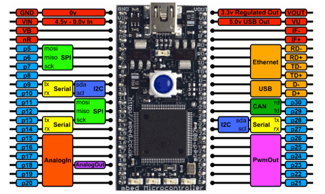

# Stick_Quest

## About

Stick Quest is a game designed in C++ for the ARM mbed LPC1768 microcontroller with peripherals

## Install

1. Clone repo:
```
git clone https://github.com/finn1y/Stick_Quest.git
```

2. Upload code to online [compiler](https://os.mbed.com/) and compile binary

3. Flash onto microcontroller

4. Enjoy gaming!

## Hardware

The following hardware was used to test the project (pin connections are given for "out of the box" use, if different pin connections are used then the source code must be changed to reflect the new pin connections):
+ mbed LPC1768 Microcontroller
+ Push buttons (connected to pins: D p26, C p27, B p28, A p29)
+ RGB LED (connected to pins: RED p22, GREEN p23, BLUE p24)
+ Joystick (connected to pins: BUTTON p17, HORIZONTAL p19, VERTICAL p20)
+ Nokia 5110 LCD (connected to pins: VCC p14, SCE p8, RESET p9, D/C p10, MOSI p11, SCLK p13, LED BACKLIGHT p21)

### LPC1768 pinout



### Pin connections

Peripheral    | Peripheral connections | LPC1786 pin
--------------|------------------------|--------------
Push Buttons  | A                      | p29
"             | B                      | p28
"             | C                      | p27
"             | D                      | p26
RGB LED       | Red                    | p22
"             | Green                  | p23
"             | Blue                   | p24
Joystick      | Button                 | p17
"             | Horizontal             | p19
"             | Vertical               | p20
Nokia 5110 LCD| Vcc                    | p14
"             | SCE                    | p8
"             | Reset                  | p9
"             | D/C                    | p10
"             | MOSI                   | p11
"             | SCLK                   | p13
"             | LED Backlight          | p21

